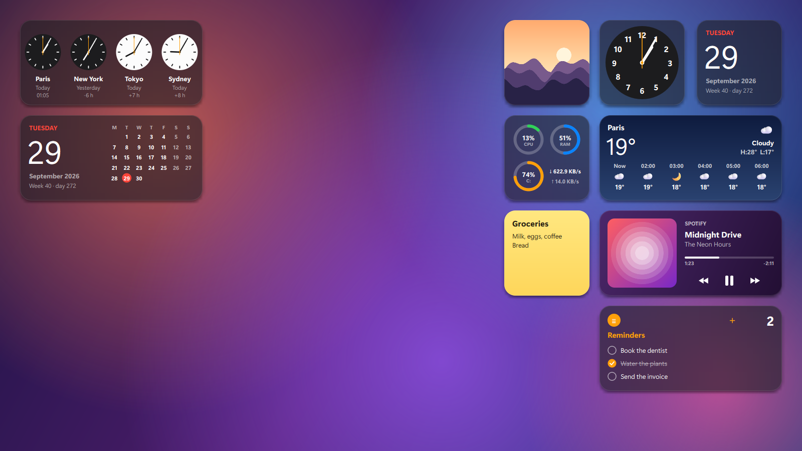
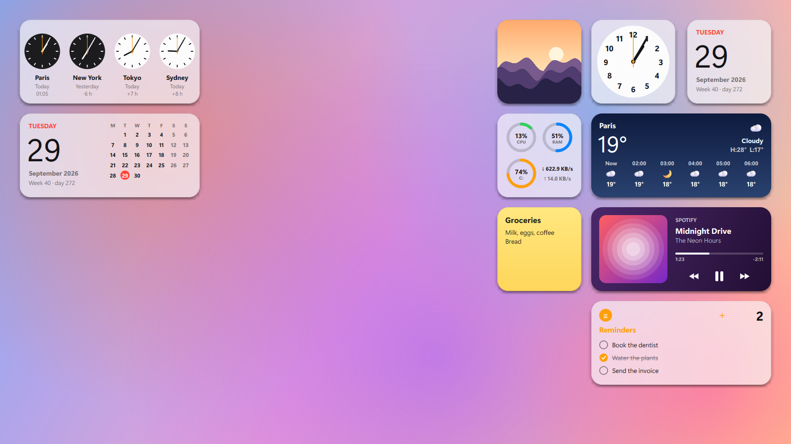
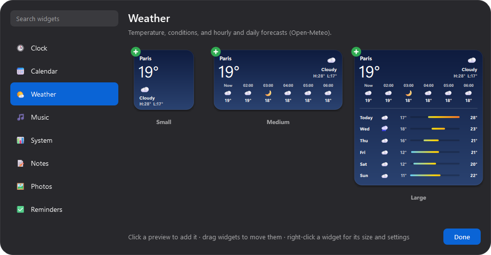
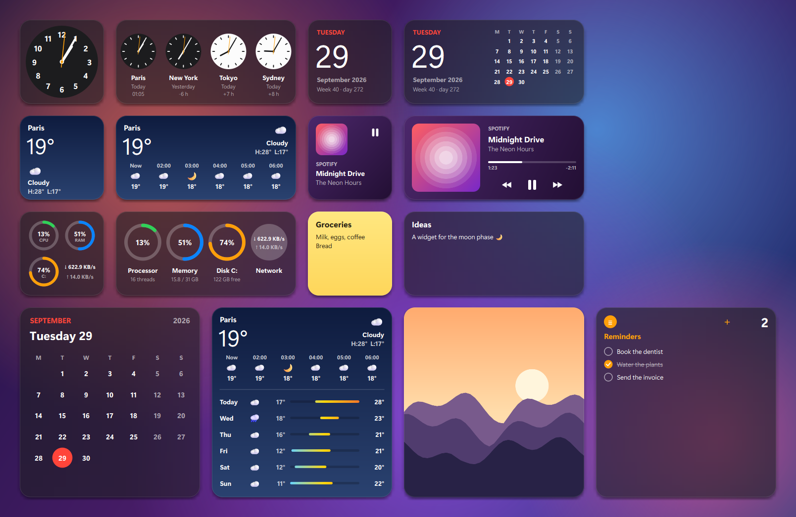

<div align="center">

# DeskWidgets

**macOS-style desktop widgets for Windows.**

Pick the widgets you want, in small, medium or large, and place them anywhere on your desktop.
They blend into your wallpaper with a frosted-glass look and stay under your windows, just like on a Mac.



[](#installation)
[](#run-from-source)
[-41CD52?logo=qt&logoColor=white)](https://doc.qt.io/qtforpython-6/)
[](LICENSE)

[**⬇ Download DeskWidgets.exe**](https://github.com/VaticUI/DeskWidgets/releases/latest)

</div>

---

## Contents

- [Features](#features)
- [Widgets](#widgets)
- [Installation](#installation)
- [Usage](#usage)
- [Run from source](#run-from-source)
- [Build the executable](#build-the-executable)
- [How it works](#how-it-works)
- [Add your own widget](#add-your-own-widget)
- [Privacy](#privacy)
- [Known limitations](#known-limitations)
- [License](#license)

## Features

- 🧩 **8 widgets**, each in up to three sizes (small, medium, large), as many as you like.
- 🪟 **On the desktop itself**: always under your windows, and still visible with **Win+D** (show desktop).
- 🧊 **Frosted glass**: each widget shows your blurred wallpaper behind it, with a soft shadow.
- 🌗 **Light and dark mode**: follows the Windows setting automatically.
- 🗂️ **Widget gallery**, like *Edit Widgets* on macOS: search, preview every size, click to add.
- 🧲 **Drag to move**: widgets snap to the screen edges and line up with each other.
- ⚙️ **Per-widget settings** with a right-click: size, city, time zones, photo folder, note color…
- 💾 **Remembers everything**: positions, sizes, notes and reminders are saved automatically.
- 🚀 **Optional autostart** from the system tray icon.

| Light mode | Widget gallery |
|---|---|
|  |  |

## Widgets



| Widget | Sizes | What it shows |
|---|---|---|
| 🕒 **Clock** | Small, Medium | Analog or digital clock for any city. Medium shows four cities, with a dark dial where it's night. |
| 📅 **Calendar** | Small, Medium, Large | Today's date, week and day number, and the month grid. |
| 🌤️ **Weather** | Small, Medium, Large | Current temperature and conditions, the next hours, and a 6-day forecast with temperature ranges. The background follows the sky. |
| 🎵 **Music** | Small, Medium | What's playing in any app (Spotify, YouTube in a browser, [NotchIsland](https://github.com/VaticUI/NotchIsland)…), with previous / play-pause / next. Colors come from the album art. |
| 📊 **System** | Small, Medium | CPU, memory, disk C: and network speed (and battery on a laptop). |
| 📝 **Notes** | Small, Medium, Large | A sticky note you write on right from the desktop. Yellow, pink, green, blue or glass. |
| 🖼️ **Photos** | Small, Medium, Large | A slideshow of a folder (your Pictures folder by default). Double-click opens the photo. |
| ✅ **Reminders** | Small, Medium, Large | A to-do list: tick to complete, **+** to add. |

## Installation

### Option 1: the executable (easiest)

1. Download **`DeskWidgets.exe`** from the [Releases](https://github.com/VaticUI/DeskWidgets/releases/latest) page.
2. Double-click it. That's it, nothing to install.

On the first launch, a clock, a calendar and the weather are placed in the top right corner, and the gallery opens.

> Windows SmartScreen may show a warning because the executable is not signed:
> click **More info → Run anyway**.

### Option 2: from source

See [Run from source](#run-from-source).

## Usage

| Action | Result |
|---|---|
| Click the tray icon (four colored squares) | Opens the widget gallery |
| Click a preview in the gallery | Adds that widget, in that size |
| Drag a widget | Moves it (it snaps to the edges and to the other widgets) |
| Right-click a widget | Change its size, edit its settings, remove it |
| **(−)** on a widget while the gallery is open | Removes it |
| Click a note | Write in it (click elsewhere or press Esc when done) |
| **+** on the Reminders widget | Adds a reminder (Enter to confirm) |
| Right-click the tray icon | **Edit widgets** / **Launch at Windows startup** / **Quit** |

Only one instance can run at a time.

## Run from source

Requirements: **Windows 10 or 11** and **Python 3.10+**.

```bash
git clone https://github.com/VaticUI/DeskWidgets.git
```

```bash
cd DeskWidgets
```

```bash
python -m venv .venv
```

```bash
.venv\Scripts\pip install -r requirements.txt
```

```bash
.venv\Scripts\pythonw main.py
```

Use `python` instead of `pythonw` to see error messages in the console.

## Build the executable

```bash
.venv\Scripts\pip install pyinstaller
```

```bash
.venv\Scripts\pyinstaller --noconfirm --onefile --windowed --name DeskWidgets --collect-submodules winrt --collect-data tzdata main.py
```

The executable is created in `dist\DeskWidgets.exe`.

## How it works

```
┌───────────────────────────┐         ┌───────────────────────────────┐
│ services.py (threads)     │   Qt    │ WidgetWindow (one per widget) │
│ weather · media · system  │ ──────▶ │ frameless, transparent,       │
└───────────────────────────┘ signals │ owned by the desktop          │
                                      │  └─ Kind.paint() (kinds.py)   │
┌───────────────────────────┐         └───────────────▲───────────────┘
│ Backdrop (core.py)        │   blurred wallpaper     │
│ wallpaper → blur → crop   │ ────────────────────────┘
└───────────────────────────┘
```

- **Desktop level**: each widget is a frameless, transparent Qt window *owned* by the desktop window (`Progman`),
  so it stays visible with Win+D. It handles `WM_WINDOWPOSCHANGING` to always stay at the bottom of the z-order,
  even when you click it.
- **Frosted glass**: the wallpaper is rendered the way Windows does (fill, fit or stretch) for each screen, blurred once,
  and each widget draws the part that is behind it, then a light or dark tint.
- **Weather**: [Open-Meteo](https://open-meteo.com) (free, no API key). The location comes from the city you type,
  or from your internet connection ([ipwho.is](https://ipwho.is)) if you leave it empty.
- **Music**: the Windows API `GlobalSystemMediaTransportControlsSessionManager` (via [PyWinRT](https://github.com/pywinrt/pywinrt)),
  the same source as the Windows volume flyout.
- **System**: [psutil](https://github.com/giampaolo/psutil).
- **Settings**: saved in `%APPDATA%\DeskWidgets\config.json`.

| File | Role |
|---|---|
| `main.py` | Entry point, widget manager (placement, snapping), tray icon, autostart |
| `core.py` | Desktop windows, frosted glass, shadow, theme, configuration, settings dialog |
| `kinds.py` | The widgets |
| `services.py` | Shared data sources, refreshed in the background |
| `gallery.py` | The widget gallery |
| `tools/screenshots.py` | Renders the images of this README (with fictional data) |

## Add your own widget

Subclass `Kind` in [`kinds.py`](kinds.py) and add it to `KINDS`:

```python
class Hello(Kind):
    id = "hello"
    title = "Hello"
    desc = "Says hello."
    icon = "👋"
    sizes = ("small", "medium")
    interval = 1000                      # refresh every second
    defaults = {"name": "world"}

    def settings_fields(self):
        return [("name", "Name", "text", None)]

    def paint(self, p, r, size):
        p.setPen(self.fg)
        p.setFont(font(22, QFont.DemiBold))
        p.drawText(r, Qt.AlignCenter, f"Hello, {self.s['name']}!")
```

It then appears in the gallery. Return a brush from `background()` for a custom background instead of the frosted glass,
and override `click()` / `on_hit()` for interactions.

## Privacy

- Nothing is collected. Your notes, reminders and settings stay in `%APPDATA%\DeskWidgets`.
- The weather widget contacts Open-Meteo, and ipwho.is only if no city is set (to guess your location from your IP address).
- The screenshots in this README use fictional data only.

## Known limitations

- The frosted glass shows the wallpaper, not the desktop icons or windows behind the widget.
- Wallpaper slideshows and "span" mode are approximated (the current image, filled on each screen).
- The weather location guessed from your connection can be off: type your city in the widget's settings.
- The Music widget shows what Windows' media controls know: some apps share neither the album art nor the position.

## License

[MIT](LICENSE). Feel free to use, modify and share it.

*Not affiliated with Apple. "macOS" is a trademark of Apple Inc.*
